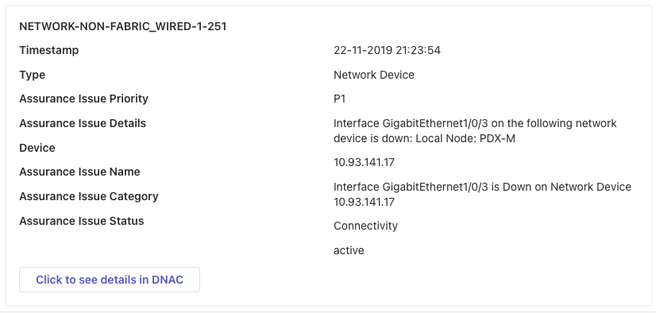
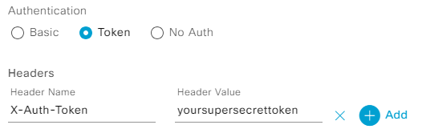

# dnac2teams

## Overview
dnac2teams is a simple webhook receiver for Cisco DNA Center notifications, forwarding all notifications events to a Microsoft Teams incoming webhook.

DNAC notifications will be displayed as Adaptive Cards in MS Teams:


## Installation 

##  Prerequisites
- Add an incoming webhook to a MS Teams team/space ([howto](https://learn.microsoft.com/en-us/microsoftteams/platform/webhooks-and-connectors/how-to/add-incoming-webhook))
- If using the preferred AWS/SAM installation method [AWS CLI](https://docs.aws.amazon.com/cli/latest/userguide/getting-started-install.html) and [AWS SAM CLI](https://docs.aws.amazon.com/serverless-application-model/latest/developerguide/install-sam-cli.html) must be installed
- For the ASW/SAM and Docker installation methods, Docker must be installed

##  AWS Serverless Application Model (SAM)
dnac2teams is using the AWS Serverless Application Model (Lambda+API-Gateway) and is best installed via SAM CLI.


- You must be logged in to AWS (via AWS CLI) 
- You need either full admin permissions or sufficient permissions on the following services:
  - Lambda
  - API Gateway
  - S3
  - Cloud Formation
  - IAM

1. Clone the repo:
    ```bash
    git clone https://github.com/spie-ics-ag/dnac2teams.git
    ```
2. Go to your project folder:
    ```bash
    cd dnac2teams
    ```
3. Edit the `template.yaml` file - Change the global environment variables (line numbers 13/14) for the Teams incoming webhook URL and the authentication token:
    ```yaml
    TEAMS_URL: https://company.webhook.office.com/webhookb2/webhookid
    AUTH_TOKEN: yoursupersecrettoken
    ```
4. Build the SAM app
    ```bash
    sam build --use-container
    ```
5. Deploy the app
    ```bash
    sam deploy --guided
    ```

Once deployed the public endpoint URL is displayed in the SAM output, use this URL and the token (specified in point 3) to create the webhook in DNAC.

## On-prem installation options
For on-prem installations, there is a simple Flask-RESTX based receiver available.

Clone the repo:
```bash
 git clone https://github.com/spie-ics-ag/dnac2teams.git
```
Go to your project folder:
```bash
cd dnac2teams
```

Deploy the app using docker or in a Python3 virtual environment

### Docker
1. Edit the `Dockerfile` file - Change the environment variables (line numbers 3/4) for the Teams incoming webhook URL and the authentication token:
    ```Dockerfile
    ENV TEAMS_URL=https://company.webhook.office.com/webhookb2/webhookid
    ENV AUTH_TOKEN=yoursupersecrettoken
    ```
2. Build the container image:
    ```bash
    docker build -t dnac2teams .
    ```  
3. Run the container:
    ```bash
    docker run --rm -p 5000:5000 dnac2teams
    ```  

### Python
1. Create a virtual environment:
    ```bash
    python3 -m venv .venv
    ```
2. Activate your venv:
    ```bash
    source .venv/bin/activate
    ```
3. Install dependencies:
    ```bash
    pip install pip --upgrade
    pip install -r requirements.txt
    ```
4. Configure the webhook URL and the authentication token as environment variables:
    ```bash
    export TEAMS_URL=https://company.webhook.office.com/webhookb2/webhookid
    export AUTH_TOKEN=yoursupersecrettoken
    ```
5. Run the app:
    ```bash
    cd dnac_to_teams
    python flaskapp.py
    ```  

### On-prem webhook endpoint
After starting either the Docker container or Python script, the webhook endpoint is available at [http://localhost:5000/prod/dnac2teams](http://localhost:5000/prod/dnac2teams). If you need a public endpoint, use [ngrok](https://ngrok.com/)

## DNAC Configuration
### Configure Destination Webhook
Setup the webhook: *DNAC&rarr;System&rarr;Settings&rarr;External Services&rarr;Destinations&rarr;Webhook*

Enter the URL from the SAM output (or the URL pointing to your local instance if you're running the on-prem version), use **Token** as the authentication method in DNAC, for the header value use the token specified in the **AUTH_TOKEN** environment variable.



## Sandboxes
You may test this app using the following DevNet sandboxes:

- [Cisco DNA Center Lab 1](https://devnetsandbox.cisco.com/RM/Diagram/Index/b8d7aa34-aa8f-4bf2-9c42-302aaa2daafb?diagramType=Topology)
- [Cisco DNA Center Lab 2](https://devnetsandbox.cisco.com/RM/Diagram/Index/1d94a25e-51bb-48eb-a9c7-dd8eac577953?diagramType=Topology)
- [Cisco DNA Center Lab 3](https://devnetsandbox.cisco.com/RM/Diagram/Index/07f8c79c-a484-4260-a286-9cc5a7fff765?diagramType=Topology)
- [Cisco DNA Center Lab 4](https://devnetsandbox.cisco.com/RM/Diagram/Index/59be6652-e919-4a7d-91ad-f7465de22bcd?diagramType=Topology)
